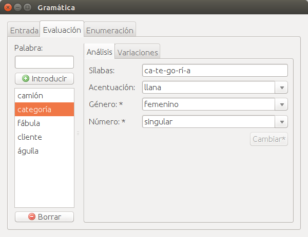
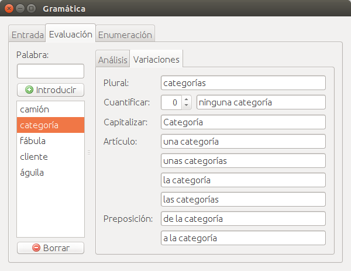
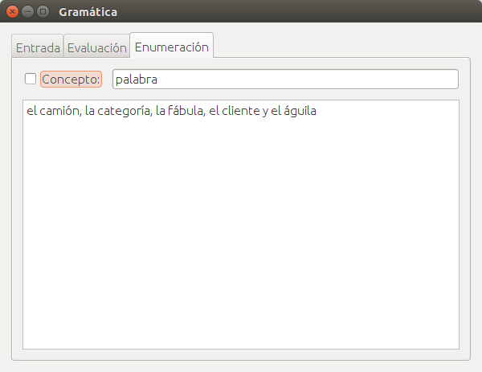
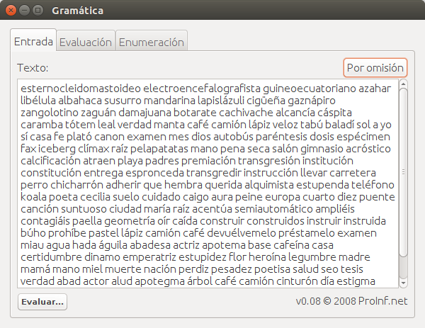

Gramática: número, género y acentuación
---------------------------------------

Funciones en Java que implementan reglas gramaticales.
Sirven para pasar una palabra a plural, descomponer una palabra en sílabas,
o indicar si una palabra es aguda, llana, esdrújula o sobreesdrújula.

Ejemplos de uso:
  - Gramatica.plural("camión") → "camiones"
  - Gramatica.silabas("paella") → "pa-e-lla"
  - Gramatica.acentuacion("águila") → "esdrújula"
  - Gramatica.genero("verdad") → "femenino"

Enlaces:
  * [Sitio web](https://proinf.net/permalink/gramatica_numero_genero_y_acentuacion)
  * [Documentación](https://proinf.net/applets/Gramatica/dist/javadoc/net/proinf/gramatica/package-summary.html)

Pantallazos de ejemplo:

